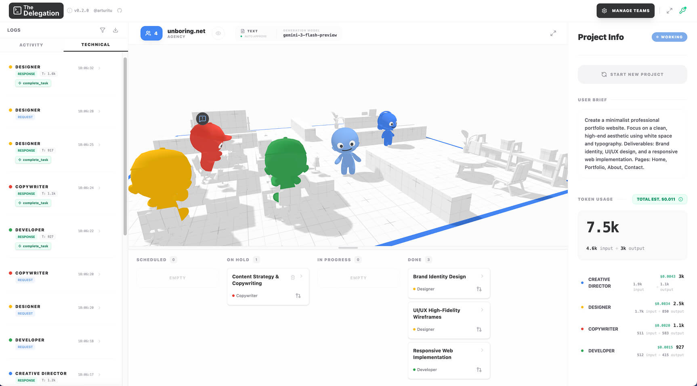

<p align="center">
  
</p>

<p align="center">
  <strong>A personal fork of <a href="https://github.com/arturitu/the-delegation">The Delegation</a> by <a href="https://x.com/arturitu">@arturitu</a></strong>
</p>

<p align="center">
  Adapted by <a href="https://github.com/gabspiewak">Gabin Spiewak</a> for personal GTM & finance use cases
</p>

---

> [!NOTE]
> **This is a fork.** The original project, concept, 3D engine, and all creative assets were built by **[Arturo Paracuellos (unboring.net)](https://unboring.net)**. This repository contains personal adaptations for specific workflows. The original project is available at [arturitu/the-delegation](https://github.com/arturitu/the-delegation).

<div align="center">
  
</div>

<br/>

## What changed in this fork

The original project uses **Gemini API** for all LLM tasks. This fork switches the text model to **Claude (Anthropic API)** and adds personal teams and workflows.

### Modifications by Gabin Spiewak

- **Claude API integration** — replaced Gemini text model with `claude-sonnet-4-6` via Vite proxy (CORS fix for Safari + Chrome)
- **Personal internship team** — 13-agent hierarchy (3 levels) tailored for a GTM internship at a French cybersecurity startup (removed from public repo)
- **Finance Analyst Team** — agents for financial modeling, market research, and investment analysis
- **Skill integration** — all agents enriched with installed skill knowledge (`copywriting`, `brand-storytelling`, `market-sizing-analysis`, `customer-research`, `marketing-psychology`, etc.)
- **Word & Excel export** — styled `.docx` and `.xlsx` download from any text output
- **Post-project chat** — lead agent remains available for follow-up after project completion
- **Safari WebGPU fix** — resolved GPU buffer pre-allocation issue causing wrong agent count on Safari

### What is unchanged

The core concept, 3D simulation engine (Three.js WebGPU), agentic architecture, UI/UX, 3D models, and all creative assets are entirely the work of Arturo Paracuellos.

---

## Original project

> **The Delegation** — A no-code 3D playground to explore, design, and interact with Agentic AI systems.
>
> Built by [Arturo Paracuellos](https://unboring.net) · [GitHub](https://github.com/arturitu/the-delegation) · [Live demo](https://arturitu.github.io/the-delegation/)

---

## Getting Started (this fork)

1. **Install dependencies:**

```bash
npm install
```

2. **Run the development server:**

```bash
npm run dev
```

3. **Open the app:** Navigate to `http://localhost:3000/the-delegation`

4. **Add your Claude API key** via the key icon in the top right (BYOK).

---

## Tech Stack

- **Engine:** [Three.js](https://threejs.org/) (WebGPU & TSL)
- **UI:** [React](https://react.dev/) & [React Flow](https://reactflow.dev/)
- **AI (text):** [Claude API](https://anthropic.com) — `claude-sonnet-4-6`
- **AI (image/video/music):** [Gemini API](https://deepmind.google/technologies/gemini/) (unchanged from original)
- **State:** [Zustand](https://github.com/pmndrs/zustand)
- **Exports:** [ExcelJS](https://github.com/exceljs/exceljs) · [docx](https://github.com/dolanmiu/docx)

---

## License & Attribution

This project follows the same dual-licensing model as the original:

- **Source Code (MIT):** Free to use, modify, and distribute. Original copyright © 2026 Arturo Paracuellos. Modifications copyright © 2026 Gabin Spiewak.
- **3D Models & Assets (CC BY-NC 4.0):** Copyright © 2026 Arturo Paracuellos ([unboring.net](https://unboring.net)). Free for personal and educational use — **cannot be used for commercial purposes** without permission.

---

Original project by [Arturo Paracuellos](https://unboring.net) · Fork by [Gabin Spiewak](https://github.com/gabspiewak)
